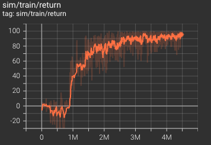
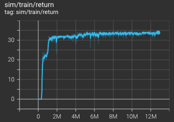
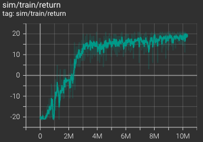

## TRANSDREAMER: REINFORCEMENT LEARNING WITH TRANSFORMER WORLD MODELS

Code for TransDreamer: The code is built upon DreamerV2 codebase. Currently only Atari and Crafter is supported.
- Preparation:
```
conda env create -f environment.yml
```
- Train the model:
```
python main.py --config-file config_files/configs_atari.py
```
- Results reproduction
  - Atari-Boxing
  
  - Atari-Freeway
  
  - Atari-Pong
  

## Citation
```
@article{chen2022transdreamer,
  title={Transdreamer: Reinforcement learning with transformer world models},
  author={Chen, Chang and Wu, Yi-Fu and Yoon, Jaesik and Ahn, Sungjin},
  journal={arXiv preprint arXiv:2202.09481},
  year={2022}
}
```